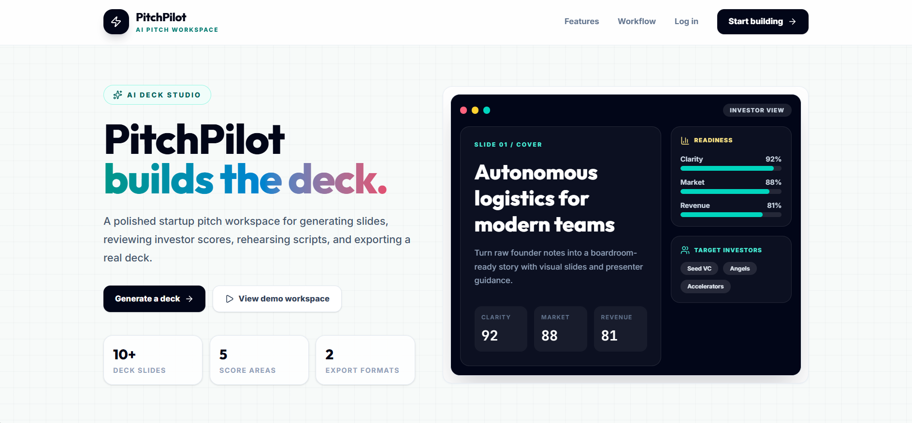
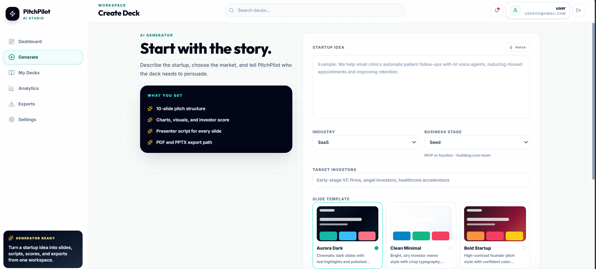
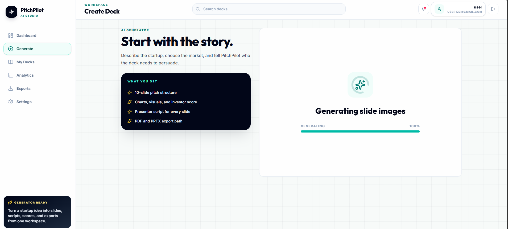
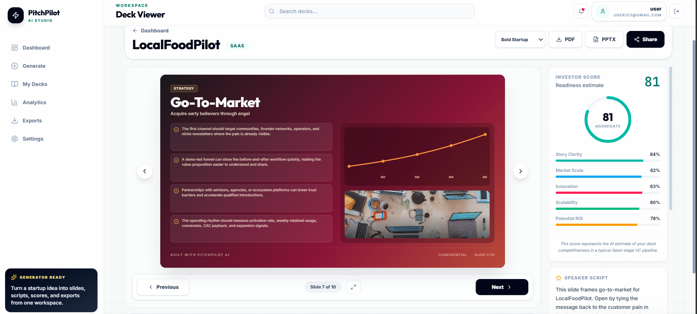
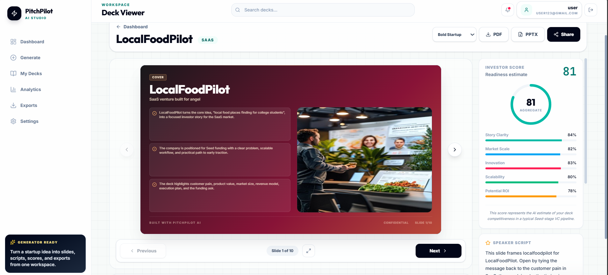

# PitchPilot AI

AI-powered startup pitch deck generator that transforms ideas into investor-ready presentations using intelligent content generation and modern UI.

---

## 🚀 Problem Statement

Creating professional pitch decks is time-consuming and difficult for early-stage founders who may not have design, storytelling, or investor-pitch experience.

---

## 💡 Solution

PitchPilot AI helps users generate structured, visually appealing, investor-ready pitch decks using AI-powered content generation and smart slide organization.

---

## ✨ Features

- AI-generated startup pitch decks
- Investor-ready slide structure
- AI-powered storytelling
- Investor score analytics
- Presenter scripts for slides
- PDF and PPTX export support
- Modern responsive UI

---

## 🛠 Tech Stack

Frontend:
- React
- TypeScript
- Vite

AI:
- Gemini API

Styling:
- Tailwind CSS

---

## ⚙️ Installation & Setup

### Prerequisites

- Node.js
- Gemini API Key

### Run Locally

```bash
npm install
```

---

## 📸 Screenshots

### Landing Page


### AI Generator


### Generation Workflow


### Deck Viewer


### Investor Analytics


---

## 👥 Team

Built collaboratively during the hackathon by:

- Sangishetty Swethanjali
---